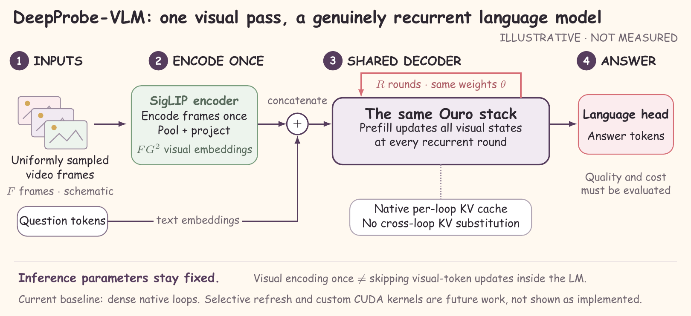
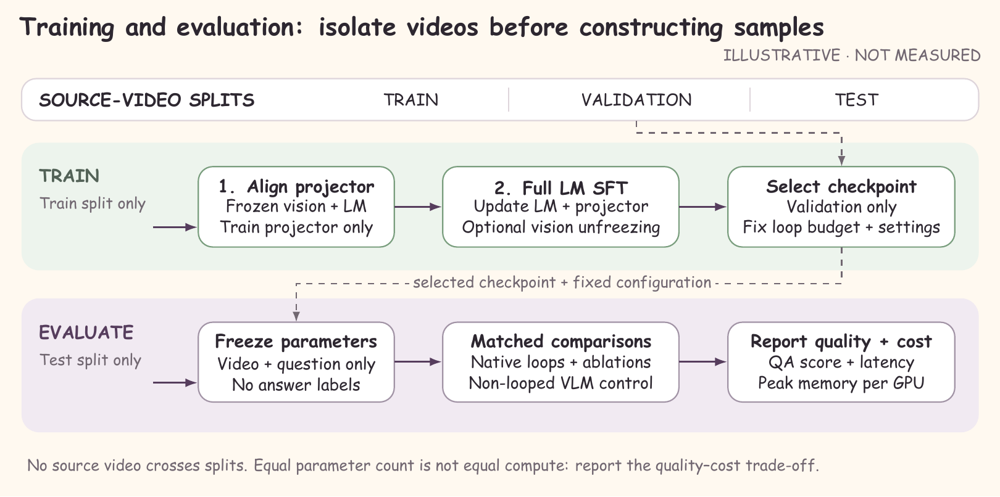
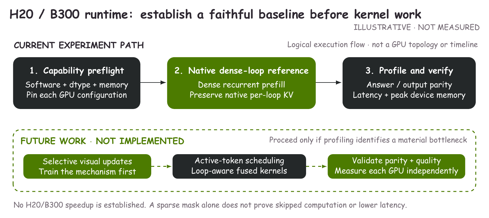

# DeepProbe-VLM / experiment

**原生 Looped Transformer 视频全参数 SFT 实验基线 · H20 / B300 实验准备版**

**先读 [实验要求与验收清单](docs/REQUIREMENTS.md)。本文所有命令均从 `experiment/` 运行；图和论文在同级 `../paper/`。**



这版先建立一个正确、可复现的稠密循环基线：**SigLIP 编码视频帧 → 可训练视觉连接器 → Ouro 原生共享权重循环 → 回答**。不是把普通 Transformer 在外面调用几次，也不是直接拿浅层 KV 冒充深层 KV。

当前为实验代码发布，**没有已测得的 H20/B300 加速或精度结果**。旧的冻结模型/选择性深层补算草稿不作为这版的实现说明。新图和 [实验协议 PDF](../paper/experiment_protocol.pdf) 明确区分已实现基线与待验证创新。

## 已交付与边界

| 部分 | 状态 |
|---|---|
| 原生 Ouro 循环 + 视频前缀 + final-loop answer-only loss | 已实现；小模型 CPU 契约测试 |
| 连接器对齐 → 全语言主干 SFT；视觉编码器可训练 | 已实现；无 LoRA，循环间不截断梯度 |
| 普通 SmolLM2 对照、DDP、保存/重载、断点续训 | 已实现；完整 GPU/DDP pilot 待跑 |
| 数据下载/转换/分组/泄漏检查/抽帧缓存 | 已实现；默认仅预览下载计划 |
| 多选/EM 评测、逐样本记录、配对成簇 bootstrap | 已实现；不是官方语义 judge |
| 选择性视觉更新、跨轮 KV 共享、TTT、自定义 CUDA/PTX | **未实现，属于后续研究分支** |

模型权重、数据集视频、个人邮件和账号信息均不在仓库中。需要审阅 Ouro 固定版本的自定义模型代码，因为加载会使用 `trust_remote_code=True`。

## 1. 环境与硬件自检

建议 Python 3.12，在服务器已有的兼容 CUDA/PyTorch 环境中安装其余依赖。**不要直接用 CPU 环境的 Torch 覆盖 B300/H20 已工作的 GPU 版本。** 可选容器及 B300 架构注意事项见 [HARDWARE.md](docs/HARDWARE.md)。

```bash
git clone https://github.com/Sunbeam23333/DeepProbe-VLM.git
cd DeepProbe-VLM/experiment
python -m pip install -r requirements/train.txt
python -m pip install --no-deps -e .
python -m pytest -q

# H20；若是 B300，将 H20 改为 B300。
python scripts/preflight.py --expected-gpu H20 --output runs/preflight/h20.json
torchrun --standalone --nproc-per-node=8 scripts/preflight.py \
  --expected-gpu H20 --output runs/preflight/h20-ddp.json
```

只有 CPU 的开发机可用 `--allow-cpu` 跑自检，但结果不能代替 CUDA 检查。可选 `DEEPPROBE_TEST_NATIVE_OURO=1 python -m pytest -q tests/test_model_native_ouro.py` 只下载固定版本模型代码/配置，以随机小模型验证原生循环，不下载预训练权重。

## 2. 准备数据

完整命令、官方来源/许可、固定 revision、媒体目录要求见 [DATASETS.md](docs/DATASETS.md)。按顺序：

1. 查看下载计划，先取 LLaVA-Video 的一个训练 pilot，不下载全库。
2. 准备 Video-MME/MVBench 测试 manifest，从训练候选中排除测试来源。
3. 按原始视频 ID 划分训练/验证，不按问答行随机拆分。
4. 验证媒体路径和 split；长实验前可离线缓存帧。

```bash
# 元数据计划；不会开始下载视频。
python scripts/data/download_hf.py llava_video_178k --list
python scripts/data/download_hf.py videomme --dry-run --max-gb 0.01

# 完成 DATASETS.md 的转换/划分步骤后：
python scripts/data/validate.py data/manifests/llava-split/train.jsonl \
  data/manifests/llava-split/validation.jsonl --media-root data/media/llava

# 精确检查模型实际会看到的文本长度；仅加载 tokenizer，不加载模型权重。
python scripts/data/check_token_budget.py \
  data/manifests/llava-split/train.jsonl \
  data/manifests/llava-split/validation.jsonl \
  --config configs/train/ouro_pilot.json \
  --report data/reports/ouro-pilot-token-budget.json
```

下载默认 dry-run，真正下载必须同时指定 `--download`、`--max-gb` 和目标目录。公开测试集只用于最终评价；MVBench 需额外授权/原始媒体的部分不能自动补齐，也不能把缺失子集冒充全量成绩。

文本长度超限时预检查会报告全部样本 ID 并退出，不会偷偷截断答案。明确调整长度预算/数据策略后再启动 GPU；`--init-checkpoint` 场景的预检查可用同名 `--checkpoint` 指向保存的 tokenizer。

## 3. 先 pilot，再完整训练

以下路径是按数据指南生成的本地文件，不随仓库分发。第一次训练会下载配置中固定 SHA 的模型权重，需要提前准备网络/缓存与磁盘空间。

```bash
# 1 GPU、20 个优化步骤：随机连接器的连通性/显存验证，不作为效果结果。
DEEP_PROBE_GPUS=1 bash scripts/launch/train.sh configs/train/ouro_pilot.json \
  --train-manifest data/manifests/llava-split/train.jsonl \
  --eval-manifest data/manifests/llava-split/validation.jsonl \
  --media-root data/media/llava --output-dir runs/pilot-1gpu

# 通过后，用新目录测试 8 卡。pilot 默认 accumulation=1。
DEEP_PROBE_GPUS=8 bash scripts/launch/train.sh configs/train/ouro_pilot.json \
  --train-manifest data/manifests/llava-split/train.jsonl \
  --eval-manifest data/manifests/llava-split/validation.jsonl \
  --media-root data/media/llava --output-dir runs/pilot-8gpu

# 阶段 A：只训练视觉池化和连接器。
bash scripts/launch/train.sh configs/train/ouro_alignment.json \
  --train-manifest data/manifests/llava-split/train.jsonl \
  --eval-manifest data/manifests/llava-split/validation.jsonl \
  --media-root data/media/llava --output-dir runs/ouro_alignment

# 阶段 B：全语言主干 + 视觉编码器 + 连接器 SFT。
bash scripts/launch/train.sh configs/train/ouro_sft.json \
  --init-checkpoint runs/ouro_alignment/final \
  --train-manifest data/manifests/llava-split/train.jsonl \
  --eval-manifest data/manifests/llava-split/validation.jsonl \
  --media-root data/media/llava --output-dir runs/ouro_sft
```

上述第一个 pilot 没有先完成连接器对齐，只检查数据、梯度和保存路径，不要求 20 步内达到可用问答精度。正式质量实验必须执行阶段 A → B；需要验证对齐后行为时，用新的 pilot 输出目录并增加 `--init-checkpoint runs/ouro_alignment/final`。

完整训练默认 8 卡、每卡 microbatch=1、accumulation=16，即 global batch=128；pilot 的全局 batch 不同，不用于跨卡公平对比。`scripts/launch/h20.sh` 和 `b300.sh` 在启动同一个 SFT 配置前增加型号自检。

`--init-checkpoint` 是新阶段的权重初始化；**精确续训**用 `--resume runs/ouro_sft/checkpoint-200`，保持同一配置、数据、world size、输出目录，并省略 `--init-checkpoint`。不能把 `final/` 当含 optimizer/RNG 的中途检查点。非空目录默认拒绝覆盖。

普通模型对照使用 `smollm2_alignment.json` → `smollm2_sft.json`，输出到不同目录。它和 Ouro 的预训练/大小不同，只是外部参考，不是循环结构因果证据。主机制消融先跑 Ouro R=1/2/4：详见 [EXPERIMENTS.md](docs/EXPERIMENTS.md)。

## 4. 评测与分析

```bash
python -m deepprobe_vlm.evaluate \
  --checkpoint runs/ouro_sft/final \
  --manifest data/manifests/videomme-test.jsonl \
  --media-root data/media/videomme \
  --output runs/ouro_sft/video_mme.jsonl --max-new-tokens 16

# --no-cache 用于全前缀重算对照；--profile 用于定位瓶颈。
# profiler 样本不能放进正式速度表。输出文件存在时拒绝覆盖。
python scripts/analysis/summarize.py \
  --predictions runs/ouro_sft/video_mme.jsonl \
  --output runs/analysis/ouro-video-mme.json
```

评测记录逐样本答案、严格多选解析、耗时、峰值显存和来源检查。推理提示不含 gold answer。开放问答 EM 不是官方语义评分。当前延迟为 cold/mixed 记录，正式速度结果还需 warmup/重复测量；不预估 H20 与 B300 的倍数。

## 文档与图

- [数据获取与来源隔离](docs/DATASETS.md)
- [模型、梯度、缓存与续训契约](docs/MODEL_CONTRACT.md)
- [硬件环境与首轮上机检查](docs/HARDWARE.md)
- [实际完成的验证与未验证事项](docs/VALIDATION.md)
- [实验矩阵与未来创新分支](docs/EXPERIMENTS.md)
- [新图审查与排版](../paper/docs/FIGURE_AUDIT.md)、[论文协议与重建](../paper/README.md)





## Release status

This is an experimental **baseline implementation**, not a reproduction claim or a finished research result. CPU tests include tiny native Ouro recurrence, cache parity, gradients, checkpoint round trips, and a Trainer alignment/SFT/resume/evaluation sequence. Full pretrained-model convergence, 8-GPU training, Docker compatibility and H20/B300 performance require server-side verification. No datasets, weights, copied third-party code or synthetic benchmark scores are distributed.
